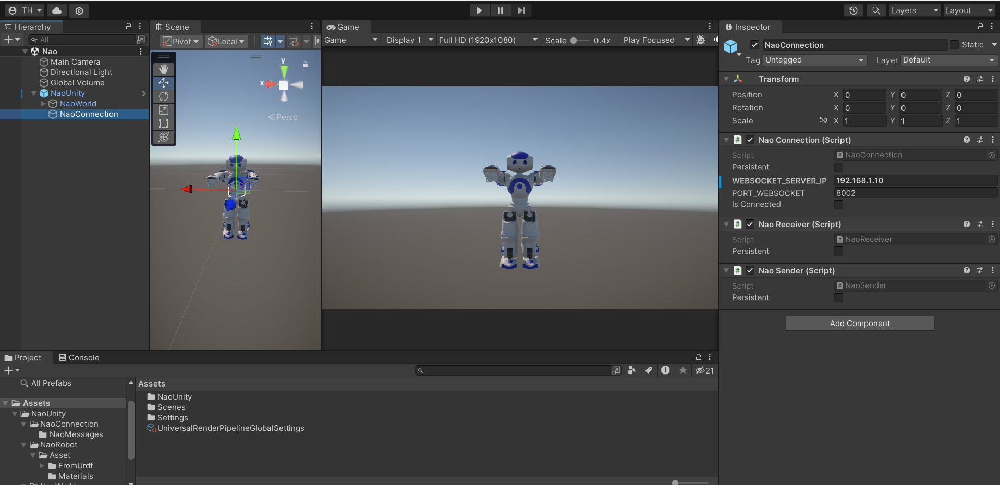

# Nao Unity



A Unity project that provides a comprehensive set of scripts for communicating with a NAO robot and its API.

This implementation uses WebSocket communication to interact with the NAO robot in real-time and relies on **NaoWebsocketServer**, a python websocket server connected to Nao API (using qi library), available in this [repository](https://github.com/funwithagents/nao-mcp).

## Overview

This project consists of several key components:

- **NaoWorld**: A singleton class that manages the robot's state, including:
  - Connection status
  - Touch sensor data
  - Joint positions
  - Microphone data
  - Associated events, triggered when data changes

- **NaoRobot**: Scripts and assets for the 3D representation of the NAO robot in Unity, including:
  - A 3D model of Nao (with hierarchy, joints, meshes and textures), generated from URDF file using package [URDF Importer](https://github.com/Unity-Technologies/URDF-Importer), and cleaned to keep the minimum, without external dependencies and relying on one custom class `CustomArticulation`
  - `RobotRepresentationManager`: a script that retrieves joint data from NaoWorld and updates the 3D model to match the robot's current posture

- **NaoConnection**: Scripts to handle WebSocket communication with the server:
  - Manage message sending and receiving and update NaoWorld with incoming data
  - `NaoConnection`: singleton that manages the websocket connection and messages with the server
  - `NaoReceiver`: singleton that subscribes to incoming messages and updates NaoWorld with received data
  - `NaoSender`: singleton with API to send messages to the websocket server

- **NaoAPI**: A singleton class that provides access to all NAO robot APIs:
  - Sends commands through NaoConnection and waits for the result (back and forth websocket communication with the server, actually calling the API)

## Prerequisites

### NaoWebsocketServer Setup

1. Clone the [nao-mcp repository](https://github.com/funwithagents/nao-mcp)
2. Install the `qi` Python package (required for real robot communication)
3. Launch the NaoWebsocketServer:
   - For real robot: 
     ```bash
     python nao_websocket_server.py --ip <nao-ip> [--with-joints-data] [--with-audio-data]
     ```
   - For simulation mode:
     ```bash
     python nao_websocket_server.py --fake-robot
     ```

> **Note**: Joint and audio data are only available in Unity when using `--with-joints-data` and `--with-audio-data` flags (not available in fake robot mode).

4. Note the WebSocket server's IP address from the initial server logs (`<websocket_server_ip>`)

### Unity Setup

1. Open the Nao_Unity project in Unity
2. Open the scene at `Assets/Scenes/Nao.unity`
3. In the scene hierarchy, select `NaoUnity/NaoConnexion`
4. In the Inspector, set the `WEBSOCKET_SERVER_IP` to your `<websocket_server_ip>`
5. Play the scene to verify:
   - Connection status in the logs
   - 3D model movement matching the robot's posture (if joint data is enabled)

## Usage

To interact with the NAO robot in your scripts, use the NaoAPI singleton:

```csharp
// Example: Calling a NAO API method
NaoAPI.Instance.ApiName();
```
